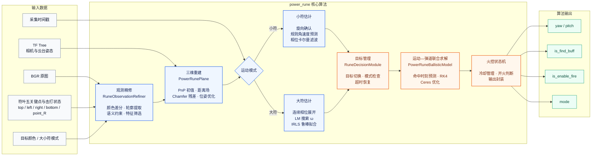
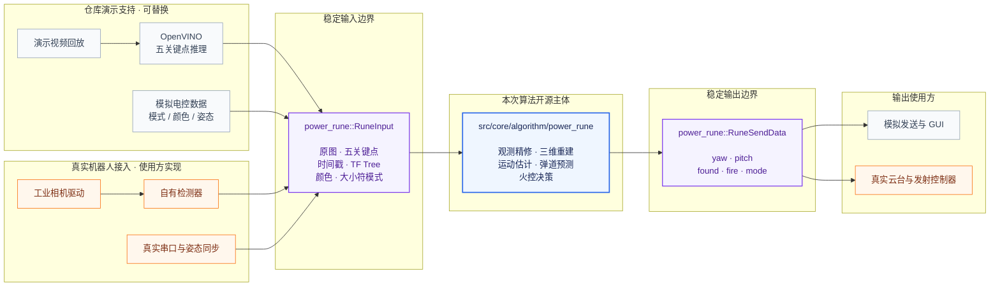
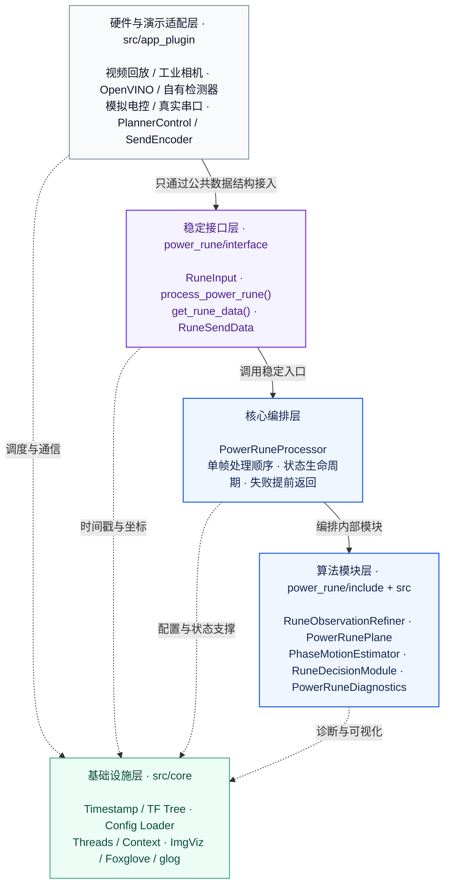
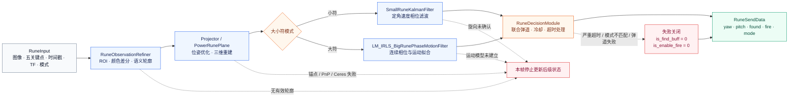
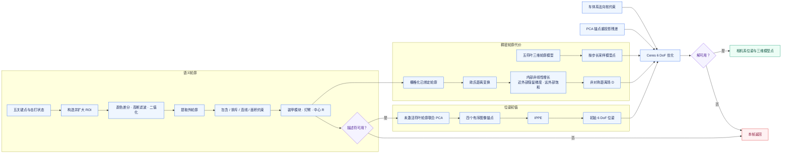
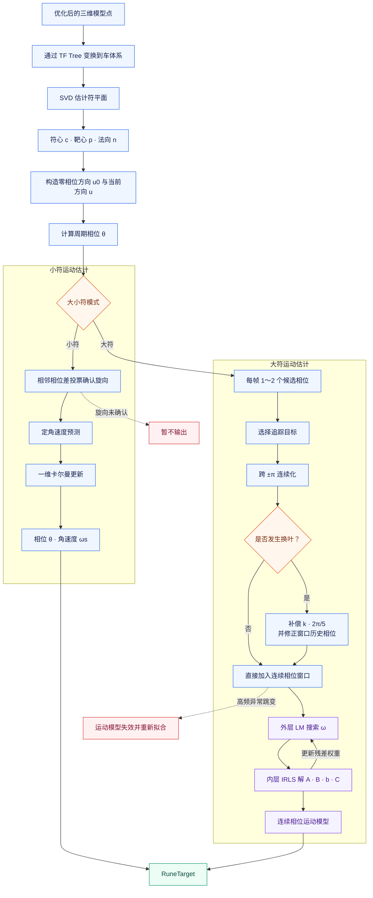
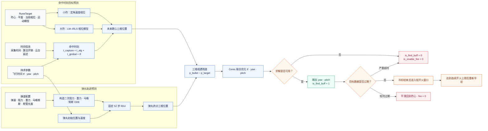

<p align="center">
  <a href="#1-核心亮点">核心亮点</a> ·
  <a href="#2-项目简介">项目简介</a> ·
  <a href="#3-效果展示">效果展示</a> ·
  <a href="#4-算法原理">算法原理</a> ·
  <a href="#5-目录结构">目录结构</a> ·
  <a href="#6-接口说明">接口说明</a> ·
  <a href="#7-roadmap">Roadmap</a>
</p>

> [!IMPORTANT]
> **开源边界：** `src/core/algorithm/power_rune` 是本次算法开源的主体。为便于无硬件复现，
> 仓库同时提供插件式运行框架、OpenVINO 推理适配器和五关键点模型文件；框架设计与模型训练
> 并非 `power_rune` 核心算法的一部分，其来源与许可证见第 8、9 节及第三方声明。

<p align="center">
  
</p>
<p align="center"><sub>语义轮廓、锚点与三维模型重投影效果</sub></p>

<p align="center">
  
</p>
<p align="center"><sub>比赛画面中的能量机关精准打击结果</sub></p>

> **无硬件演示：** 已验证环境为 Ubuntu 22.04、CMake 3.22+ 和 C++20，依赖 OpenCV、
> OpenVINO 2024、Eigen3、Sophus、Ceres、Boost 与 glog。首次使用先运行
> `./scripts/setup_ubuntu22.sh` 配置并检查环境，再执行 `./run_demo.sh` 启动随仓视频、模型和
> 模拟电控数据组成的完整链路；无桌面环境使用 `./run_demo.sh --headless`，按 `Ctrl+C` 退出。

## 1. 核心亮点

- **基于网络关键点的语义分割与传统算法结合的轮廓特征提取算法：** 通过网络识别的关键点，
  对传统算法提取的轮廓进行语义分割，将可利用的特征从离散关键点扩展为带有语义信息的轮廓，
  从而绕开继续提取关键点作为特征的常规思路。约束所需的特征由网络自动生成，再结合简单的
  逻辑与约束完成语义分割，在提取更多信息的同时减少大量可调超参数。

- **基于倒角残差优化和非线性距离场的姿态解算算法：** 首先通过 PCA 与 PnP 获取初始姿态，
  随后采用倒角残差作为损失函数，使用非线性距离场计算代价，并引入云台姿态进行正则约束。
  通过充分利用轮廓信息，该方法有效缓解了关键点遮挡和目标部分遮挡造成的解算不稳定，同时
  提高了解算精度与稳定性；在 `9 m` 处，水平距离抖动控制在 `±3 cm` 内。

- **无约束 LM–迭代重加权最小二乘拟合算法（LM–IRLS）：** 采用 LM 方法进行高速一维搜索，
  再使用鲁棒核函数构造代价函数，根据拟合残差与数据时间不断更新数据权重并迭代求解。在不
  引入额外约束的情况下，模型对 `0.5 s` 后的平均相位预测误差为 `0.02 rad`；`0.5 s` 是赛场上
  常见的弹丸飞行时间。在无控制误差和机械散布的理想条件下，对应的理论命中弧长误差约为
  `1.4 cm`。引入鲁棒核函数后，同一组参数实现了区赛与国赛拟合算法的零调参复用。

- **高解释性的弹道模型及拦截方程：** 采用水平、竖直方向的二次空气阻力和垂直于速度方向的
  马格努斯升力项作为弹丸物理模型，并结合符的运动方程构建拦截方程。算法使用 RK4 积分，
  调用 Ceres 进行求解；在数值求解测试中，飞行时间的求解误差小于
  $10^{-9}\,\mathrm{s}$，落点误差小于 $10^{-9}\,\mathrm{m}$。

- **自动火控系统：** 通过多因素决策实现全自动瞄准与自动开火。在 `8 m` 距离下激活能量机关，
  完成十片目标激活的耗时为 `8–10 s`；操作手全程无需介入，降低了场上操作手的心理压力与
  操作难度。

- **拟合自诊断系统：** 由独立线程对拟合算法和预测算法进行高频自诊断。场上出现冲撞、开启
  陀螺后严重抖动或位置大幅变化等情况时，系统可在 `0.1 s` 内完成识别，并在 `2 s` 内重新
  恢复拟合。


## 2. 项目简介

### 2.1 背景与目标

在 RoboMaster 比赛中，能量机关激活要求视觉系统持续估计符叶的几何状态与旋转运动，
并在图像处理、云台响应和弹丸飞行均存在延迟的情况下，计算合适的瞄准位置与开火时机。
实际赛场还会出现局部遮挡、特征缺失、目标切换、光照变化和机体运动等干扰，因此算法
不仅需要保证预测精度，还需要具备稳定的异常恢复能力和清晰的调参逻辑。

本项目是深圳大学 RobotPilots 战队 2026 赛季能量机关算法的公开实现。我们在吸收社区
既有开源经验的基础上，重新设计并实现了从轮廓特征提取、三维位姿解算、大小符运动建模，
到弹道预测和自动火控的完整算法链路。项目以可解释、可复现和便于移植为主要设计目标，
希望为能量机关算法的学习、部署与进一步研究提供一套完整参考。

### 2.2 算法职责与处理链路

`power_rune` 位于神经网络检测之后、机器人执行控制之前。算法接收当前帧原图、符叶
五关键点、击打状态、图像采集时间戳和坐标变换信息，依次完成轮廓观测精修、三维位姿
重建、旋转运动估计、目标预测和弹道解算，最终输出云台瞄准角度与开火状态。

整体处理链路如下：



各阶段的主要职责如下：

| 阶段 | 主要功能 |
| --- | --- |
| 观测精修 | 根据网络关键点限定处理区域，从原图中提取装甲模块、灯臂和中心 R 等带语义轮廓 |
| 三维重建 | 结合模型轮廓、锚点和云台姿态，优化能量机关位姿并恢复符心、靶心和符平面 |
| 小符估计 | 确认旋转方向，使用规则角速度预测和卡尔曼滤波获得连续相位 |
| 大符估计 | 使用 LM–IRLS 拟合连续相位运动模型，并降低异常观测对预测结果的影响 |
| 弹道与决策 | 预测弹丸命中时刻的靶心位置，求解 `yaw`、`pitch`，并管理目标切换、冷却和开火状态 |

网络检测只负责提供符叶关键点和击打类别，`power_rune` 不直接依赖某一种网络结构。
算法首先利用关键点限定局部处理区域，再从原图中提取带语义的轮廓特征；随后通过模型
投影和非线性优化恢复能量机关三维状态，并根据大小符模式选择对应的运动估计方法。
最后，运动模型、弹道模型和火控状态共同决定瞄准角度与开火时机。

本节只说明整体职责与数据流。各模块的数学模型、优化变量和异常处理将在后文分别说明。

### 2.3 开源范围与仓库边界

#### 2.3.1 接入边界

本次算法开源的主体为 `src/core/algorithm/power_rune`。该目录实现了从符叶观测结果到
火控指令的核心流程。为了使项目在没有相机、串口和下位机的条件下也能运行，仓库同时
提供了网络推理、视频回放和模拟电控插件；这些内容属于复现支持，可以替换，不构成
`power_rune` 的算法接口。



<p align="center">图 2.1：演示链路、真实机器人链路与 power_rune 稳定接口边界</p>

| 内容 | 位置 | 定位 |
| --- | --- | --- |
| 核心算法 | `src/core/algorithm/power_rune` | 本次算法开源主体 |
| 对外接口 | `src/core/algorithm/power_rune/interface` | 定义稳定的输入输出结构 |
| 接入文档 | `src/core/algorithm/power_rune/docs` | 接口、线程模型和参数说明 |
| 运行配置 | `config/power_rune.json` | 相机、重建、运动、弹道和火控参数 |
| 网络推理插件 | `src/app_plugin/detector` | 为演示提供关键点输入，可以替换 |
| 视频回放插件 | `src/app_plugin/single_camera_manager` | 为演示提供无相机输入，可以替换 |
| 模拟电控插件 | `src/app_plugin/receive_decoder` | 为演示提供模式和姿态数据，可以替换 |
| 环境配置 | `scripts/setup_ubuntu22.sh` | 安装 Ubuntu 依赖并检查 CMake 与演示资源 |
| 一键演示 | `run_demo.sh` | 构建并运行无硬件演示链路 |

调用方只要能够按照 `power_rune::RuneInput` 提供同一采集时刻的图像、关键点、时间戳和
坐标变换信息，就可以替换仓库中的网络、相机和通信插件，而无需修改核心算法。

神经网络训练、特定相机驱动、真实串口协议以及下位机控制器不属于 `power_rune` 的
算法范围。仓库中涉及第三方网络模型和部署实现的部分，遵循其各自的许可证与第三方声明。

#### 2.3.2 软件架构与层级

仓库按照“硬件与演示适配—稳定接口—核心编排—算法模块—基础设施”分层。上层插件只负责
把相机、网络和电控数据适配为公共输入，核心算法不反向依赖具体设备；调用方也只通过
`power_rune` 接口读写数据，不需要跨层访问算法内部状态。



<p align="center">图 2.2：仓库软件分层、依赖方向与对外接口</p>

### 2.4 适用场景

本项目适合以下使用方式：

- 学习能量机关轮廓精修、三维重建、运动建模和预测火控的完整实现；
- 将 `power_rune` 接入已有的相机、检测器和电控通信框架；
- 使用仓库提供的视频与模拟电控数据，在无硬件条件下验证算法接口和数据流；
- 基于公开接口替换检测网络、调试工具或上层应用，而不修改核心算法。

仓库默认参数与演示素材及原机器人标定相关。部署到其他机器人前，需要重新确认相机
内参与畸变、相机到云台的坐标变换、目标颜色、弹丸速度、系统延迟和机械补偿。内置
视频演示用于验证软件链路，不替代真实机器人上的精度、命中率与长期稳定性测试。

### 2.5 运行环境与依赖

#### 2.5.1 已验证的软件环境

当前仓库的一键回放演示已在下列环境完成构建与运行验证。表中“验证版本”用于说明本项目
已实际使用过的组合；除已明确标注的项目外，不代表软件只能运行在该版本。

| 项目 | 要求或用途 | 验证版本 |
| --- | --- | --- |
| 操作系统 | 64 位 Linux | Ubuntu 22.04.5 LTS（x86-64） |
| C++ 工具链 | 支持 C++20 | GCC 11.4.0 |
| CMake | `3.22+` | 3.22.1 |
| OpenCV | `4.5.4+`；图像处理、标定、视频回放与 HighGUI | 4.6.0 |
| OpenVINO | 五关键点网络推理；演示配置默认使用 `CPU` | 2024.4.0 |
| Eigen3 / Ceres | 线性代数与非线性优化 | Eigen 3.4.0 / Ceres 2.2.0 |
| Sophus | SE(3) 位姿表示；Ubuntu 22.04 无对应开发包，由脚本从源码安装 | 1.22.10 |
| Boost / glog | 基础工具与日志 | Boost 1.74.0 / glog 0.4.0 |
| H.264 解码后端 | 解码随仓 MP4；需要 OpenCV 可调用 FFmpeg 或 GStreamer | FFmpeg 4.4.2 |

Foxglove SDK 已随 `src/core/utility/foxglove` 提供，不需要单独下载。完整工程在配置阶段会
检查上述外部依赖；若只将 `power_rune` 接入其他框架，仍需满足其 CMake 文件中声明的
OpenCV、Eigen3、Ceres、Sophus、Boost 与 glog 依赖。

#### 2.5.2 硬件环境与复现边界

| 场景 | 硬件要求 | 说明 |
| --- | --- | --- |
| 随仓无硬件演示 | 不需要相机、串口、下位机或独立显卡 | 已在 AMD Ryzen 9 7940HX、16 GB 内存上使用 OpenVINO CPU 推理验证；该配置不是最低硬件要求 |
| 推理设备 | 默认使用 CPU；可按 OpenVINO 环境改为 `AUTO` 或 `GPU` | 修改 `src/app_plugin/detector/config/detect.json` 中的 `device` |
| 演示视频 | 能够实时解码 H.264 的通用 x86-64 主机 | 随仓视频和默认相机标定均为 `1440×1080` |
| 真实机器人 | 工业相机、云台姿态来源、通信链路与发射机构由接入方提供 | 相机型号和串口协议不受核心算法限定，但必须提供同一采集时刻的原图、关键点、时间戳和 TF Tree |

默认内参与畸变、相机到云台的变换、弹速、延迟和机械补偿只适用于原演示配置。更换相机、
分辨率或机器人后必须重新标定并验证参数，不能直接把上述开发机配置理解为精度或实时性保证。

#### 2.5.3 一键配置、检查与运行

仓库提供 Ubuntu 22.04 x86-64 环境配置脚本。脚本根据本项目的 CMake 与源码依赖安装以下内容：

| 类别 | 安装内容 | 对应用途 |
| --- | --- | --- |
| 编译工具 | `build-essential`、`cmake`、`pkg-config` | GCC/G++、CMake 配置与 C++20 构建 |
| 图像与视频 | `libopencv-dev`、`ffmpeg` | 图像处理、标定、HighGUI、视频回放与 H.264 解码 |
| 数学与优化 | `libeigen3-dev`、`libceres-dev`、`libgflags-dev` | 矩阵计算、位姿与弹道非线性优化 |
| 基础库 | `libboost-all-dev`、`libgoogle-glog-dev` | CMake 声明的 Boost 依赖与运行日志 |
| 网络推理 | OpenVINO `2024.4.0` C++ 开发包、CPU 与 AUTO 插件 | 加载 ONNX 模型并执行五关键点推理 |
| 位姿库 | Sophus `1.22.10` | `TFTree` 和 SE(3) 坐标变换 |

首次配置环境：

```bash
./scripts/setup_ubuntu22.sh
```

脚本会在需要修改系统环境时调用 `sudo`，使用签名密钥配置 OpenVINO 官方 APT 源，并从
Sophus `1.22.10` 发布标签构建安装 Sophus。安装完成后，它还会检查随仓模型、视频和配置文件，
在临时目录中执行一次干净的 CMake 配置，并实际解码一帧 H.264 演示视频。脚本可以重复执行，
已经满足版本要求的 Sophus 不会再次构建。

如果依赖已经安装，只检查当前环境而不修改系统：

```bash
./scripts/setup_ubuntu22.sh --check
```

环境检查通过后启动演示：

```bash
# 有桌面环境：显示 OpenCV 调试窗口
./run_demo.sh

# 无桌面环境或 SSH 会话：不创建 GUI 窗口
./run_demo.sh --headless
```

也可以手动执行 Release 构建：

```bash
cmake -S . -B build -DCMAKE_BUILD_TYPE=Release
cmake --build build --parallel 4
./output/app
```

配置脚本只覆盖随仓无硬件演示所需的软件环境，不会安装工业相机 SDK、串口规则或 Intel GPU
驱动。默认 CPU 推理不要求独立显卡；若把 `device` 改为 `GPU`，还需按照 OpenVINO 文档为具体
硬件安装对应的 GPU 运行时。OpenVINO 软件包安装方式见
[OpenVINO 2024 APT 安装文档](https://docs.openvino.ai/2024/get-started/install-openvino/install-openvino-apt.html)，
Sophus 源码与版本标签见 [Sophus 官方仓库](https://github.com/strasdat/Sophus/tree/1.22.10)。

## 3. 效果展示

### 3.1 整体流程效果

下面展示一帧能量机关观测从网络关键点输入，到轮廓精修、距离场构建和三维模型
重投影的完整处理过程：

```text
五关键点检测 → 颜色差分二值化 → 轮廓语义划分 → 距离场构建 → 模型优化与重投影
```

#### 3.1.1 全流程总览

<p align="center">
  
</p>
<p align="center">图 3.1：从网络观测到三维重投影的完整处理流程</p>

#### 3.1.2 分阶段结果

<table>
  <tr>
    <td width="50%" align="center">
      
      <br><b>（a）网络观测</b><br>
      五关键点与符叶击打状态
    </td>
    <td width="50%" align="center">
      
      <br><b>（b）颜色差分二值化</b><br>
      在局部 ROI 中分离目标亮区
    </td>
  </tr>
  <tr>
    <td width="50%" align="center">
      
      <br><b>（c）轮廓语义划分</b><br>
      区分装甲模块、灯臂与中心 R
    </td>
    <td width="50%" align="center">
      
      <br><b>（d）距离场构建</b><br>
      为 Chamfer 残差提供连续代价
    </td>
  </tr>
  <tr>
    <td colspan="2" align="center">
      
      <br><b>（e）模型优化与重投影</b><br>
      将优化后的三维模型重新投影到原图，用于直观检查位姿解算结果
    </td>
  </tr>
</table>

<p align="center">图 3.2：能量机关算法各处理阶段的中间结果</p>

### 3.2 典型困难场景

实际赛场中的高速相对运动、大角度观测和局部遮挡会破坏关键点与轮廓的完整性。下面
分别展示算法在三类典型困难场景中的观测精修与模型重投影结果。

#### 3.2.1 动态模糊

目标与相机发生快速相对运动时，灯臂和装甲模块会产生明显拖影。下图同时展示动态模糊
输入、二值化结果、语义轮廓与模型重投影。

<p align="center">
  
</p>
<p align="center">图 3.3（a）：动态模糊场景</p>

#### 3.2.2 极端侧视

在较大的侧向观察角度下，能量机关会出现明显的透视形变，部分符叶特征也更容易发生
重叠。下图展示该视角下的三维模型重投影结果。

<p align="center">
  
</p>
<p align="center">图 3.3（b）：极端侧视场景</p>

#### 3.2.3 特征遮挡

当部分符叶、灯臂或中心特征不可见时，算法使用当前仍然有效的语义轮廓参与位姿优化。
下图展示局部特征缺失时的轮廓提取、二值化与模型重投影结果。

<p align="center">
  
</p>
<p align="center">图 3.3（c）：局部特征遮挡场景</p>

### 3.3 曲线与误差

下面按照数据在追踪与火控链路中的流动顺序，展示大符双相位观测、相位连续化、运动
模型预测误差，以及最终控制指令与真实云台反馈之间的关系。

```text
双相位观测 → 目标追踪 → 相位连续化 → 运动模型拟合与预测 → 火控指令与云台反馈
```

#### 3.3.1 双相位观测与目标追踪

大符模式下一帧中可能同时出现两个候选相位。追踪器结合前序状态选择当前目标，在候选
相位之间完成连续追踪。

<p align="center">
  
</p>
<p align="center">图 3.4（a）：大符双相位观测与追踪结果</p>

追踪器进一步处理相位周期跳变和目标切换，将周期相位转换为可供运动模型拟合的连续
相位序列。

<p align="center">
  
</p>
<p align="center">图 3.4（b）：追踪相位连续化结果</p>

#### 3.3.2 运动模型拟合与预测误差

下图上半部分对比模型预测相位与实际观测相位，下半部分给出对应的相位误差。在排除
目标切换、周期跳变和未成功时间配对的区间后，连续追踪段的平均预测误差约为
`0.02 rad`，误差波动范围小于 `0.07 rad`。图中的大幅跳变对应目标切换或相位尚未完成
连续化的时刻，不纳入上述统计。

<p align="center">
  
</p>
<p align="center">图 3.5：大符运动模型的相位预测与误差</p>

#### 3.3.3 火控输出与云台反馈

下图对比预测曲线、实际发送曲线与串口反馈的云台曲线，用于观察算法输出、指令发送与
机械执行之间的跟随关系。

<p align="center">
  
</p>
<p align="center">图 3.6：预测结果、发送指令与实际云台反馈对比</p>

### 3.4 比赛第一视角

下面的片段截取自比赛录像展示空中机器人激活大能量机关时的
第一视角。

<p align="center">
  <a href="./assets/video/competition_first_person_16m24s_16m39s.mp4">
    
  </a>
</p>
<p align="center"><b>视频 3.1：比赛第一视角下的大能量机关激活过程</b></p>
<p align="center">点击封面播放，或<a href="./assets/video/competition_first_person_16m24s_16m39s.mp4">直接打开 MP4 视频</a></p>

## 4. 算法原理

本节按照“观测从哪里来、状态如何恢复、未来怎样预测、何时允许开火”的顺序解释
`power_rune`。所有流程、公式和异常分支均从当前源码及运行配置中提取；类名、状态变量、
残差项和求解顺序都能在文末给出的代码入口中核对。没有进入当前实现的设想，不作为项目
已有能力写入本节。

整套算法贯穿一个设计原则：**让学习方法处理外观与语义的不确定性，让几何模型处理
尺度与物理一致性。** 网络给出的五关键点并不直接决定最终三维位姿，而是用于限定 ROI、
标记部件类别并绑定轮廓；位姿、运动和弹道则分别由可解释的几何优化、时间序列拟合和
物理方程求解。这一分工正对应第 1 节强调的“网络与传统视觉结合”“倒角残差位姿优化”
和“高解释性拦截方程”。


<p align="center">图 4.1：power_rune 的源码级数据流与失败关闭路径</p>

### 4.1 从稀疏语义到稠密几何

网络为每片符叶提供 `top`、`left`、`right`、`bottom`、`point_R` 五个语义点，以及
击打状态。算法先用这些点构造并扩大旋转 ROI，再在 ROI 中进行颜色差分：

$$
I_{\Delta}(\mathbf{u})=
\begin{cases}
R(\mathbf{u})-B(\mathbf{u}), & \text{红色目标},\\
B(\mathbf{u})-R(\mathbf{u}), & \text{蓝色目标}.
\end{cases}
$$

差分图经过 `5×5` 高斯滤波、阈值分割和外轮廓提取后，关键点不再只是五个独立坐标，
而是成为轮廓的语义约束。三类轮廓的判定逻辑如下：

| 语义轮廓 | 关键约束 | 多候选时的选择 |
| --- | --- | --- |
| 装甲模块 | 包含四点均值形成的模块中心；面积接近四关键点诱导的椭圆面积 | 相对面积误差最小 |
| 灯臂 | 模块中心与 `point_R` 均在轮廓外；二者连线穿过轮廓；左右关键点连线不穿过 | 面积最大 |
| 中心 R | 包含 `point_R`；排除四个模块关键点和模块中心 | 面积最小 |

随后，算法用实心度、长宽比、多边形拐点数和图像边界距离判断轮廓能否进入位姿优化。
这一步的关键不是用大量阈值重新“识别”目标，而是利用网络已经给出的语义关系，把原本
无类别的像素轮廓转换成可与三维模型对应的稠密观测。因此，后续优化可以利用整段边缘，
而不必把所有度量信息压在少数关键点上。

对应实现：[`RuneObservationRefiner.cpp`](./src/core/algorithm/power_rune/src/RuneObservationRefiner.cpp)

### 4.2 非对称距离场与 Chamfer 位姿优化

设能量机关轮廓模型为 $\mathcal{M}=\{\mathbf{p}_i\in\mathbb{R}^3\}$，待求的目标到
相机变换为 $\mathbf{T}=(\mathbf{R},\mathbf{t})\in SE(3)$。模型点在相机中的投影为

$$
\pi(\mathbf{T}\mathbf{p}_i)=
\begin{bmatrix}
f_x X_i/Z_i+c_x\\
f_y Y_i/Z_i+c_y
\end{bmatrix},
\qquad
\begin{bmatrix}X_i&Y_i&Z_i\end{bmatrix}^{\mathsf T}
=\mathbf{R}\mathbf{p}_i+\mathbf{t}.
$$

当前实现并不是用同一条轮廓解释所有符叶状态，而是分别建立未激活符叶、小符已激活符叶
和大符已激活符叶的平面轮廓模型。三类模型点在优化时按照网络给出的符叶状态参与投影，
再与对应的语义轮廓距离场建立残差。

<table>
  <thead>
    <tr>
      <th align="center">未激活符叶模型</th>
      <th align="center">小符已激活模型</th>
      <th align="center">大符已激活模型</th>
    </tr>
  </thead>
  <tbody>
    <tr>
      <td align="center"></td>
      <td align="center"></td>
      <td align="center"></td>
    </tr>
  </tbody>
</table>
<p align="center">图 4.2：位姿优化使用的三类符叶投影轮廓模型</p>

模型由五份相隔 $2\pi/5$ 的符叶轮廓组成。第一片可靠的未激活符叶被设为 1 号位，
其余观测依据“符心到部件中心”的图像方向分配到 2～5 号位。算法把未激活符叶的装甲
模块与灯臂轮廓联合做 PCA，得到四个锚点并排序，先用 IPPE 求出粗位姿；锚点的作用是
把优化带入正确的语义吸引域，而不是代替后续的稠密轮廓优化。

PCA 的特征向量只有轴线，没有天然的正负方向：$\mathbf{v}$ 与 $-\mathbf{v}$ 表示同一条
主轴。如果直接按照 PCA 坐标系的符号给四个角点编号，不同符叶上的左上、左下、右下、
右上可能发生翻转，破坏二维锚点与三维模型锚点的一一对应。当前实现因此不依赖 PCA 主轴
的正负号，而是先按角点到符心的距离区分上下边，再用边方向与“锚框中心指向符心”方向的
叉积固定左右顺序。

<table>
  <thead>
    <tr>
      <th align="center">PCA 主轴方向未消歧</th>
      <th align="center">错误锚点对应导致的错误优化</th>
    </tr>
  </thead>
  <tbody>
    <tr>
      <td align="center"></td>
      <td align="center"></td>
    </tr>
  </tbody>
</table>
<p align="center">图 4.3：PCA 方向歧义从锚点错配传播到位姿优化的故障链</p>

左图展示了未消解主轴方向时，不同符叶的角点语义编号不一致；这些错误对应一旦进入 PnP，
就会产生错误的位姿初值。Ceres 随后进行的是局部优化，即使轮廓残差仍能下降，也可能停在
右图所示的错误姿态。因此，锚点排序既是初始化步骤，也是后续稠密优化成立的前提。


<p align="center">图 4.4：从语义轮廓到非对称距离场，再到 6 DoF 位姿优化</p>

#### 4.2.1 非线性非对称距离场

将已绑定轮廓栅格化后，欧氏距离变换给出像素 $\mathbf{u}$ 到最近轮廓的距离
$d(\mathbf{u})$。普通距离场在轮廓内外近似对称，容易出现模型投影陷入轮廓内部、翻面
或收缩到错误低代价区的歧义。当前实现将其重映射为

$$
D(\mathbf{u})=
\begin{cases}
0, & \mathbf{u}\in\Omega_{\mathrm{edge}},\\
\phi\!\left(d(\mathbf{u})\right), & \mathbf{u}\in\Omega_{\mathrm{inside}},\\
\phi\!\left(d(\mathbf{u})\right), & \mathbf{u}\in\Omega_{\mathrm{near\text{-}outside}},\\
\tau, & \text{其他区域},
\end{cases}
$$

其中 $\tau$ 是单个模型点的最大残差。$\phi$ 按整数距离层使用
$0,1,2,3,5,8,\ldots$ 的类 Fibonacci 增长：轮廓内部始终快速增大，外部只在自适应
近邻带内保留梯度，远处直接饱和。这样既抑制错误姿态，又避免离目标很远的模型点主导求解。

<table>
  <thead>
    <tr>
      <th align="center">普通线性距离场</th>
      <th align="center">非线性非对称距离场</th>
    </tr>
  </thead>
  <tbody>
    <tr>
      <td align="center"></td>
      <td align="center"></td>
    </tr>
  </tbody>
</table>
<p align="center">图 4.5：普通线性距离场与当前非线性非对称距离场的代价分布对比</p>

左图中，距离代价随轮廓内外的欧氏距离近似线性扩散；右图对应当前实现，轮廓内部快速
增大，外部仅在有限邻域保留优化梯度。该对照直观展示了重映射如何改变优化的吸引域，
其准确数值仍由上式中的 $\phi$ 与饱和值 $\tau$ 定义。

#### 4.2.2 亚像素残差与联合目标函数

模型投影通常落在四个像素之间，因此算法用双线性插值连续采样距离场。令
$u_0=\lfloor u\rfloor$、$v_0=\lfloor v\rfloor$、$\Delta u=u-u_0$、
$\Delta v=v-v_0$，则

$$
\begin{aligned}
D(u,v)={}&(1-\Delta u)(1-\Delta v)D_{00}
+\Delta u(1-\Delta v)D_{10}\\
&+(1-\Delta u)\Delta vD_{01}
+\Delta u\Delta vD_{11}.
\end{aligned}
$$

单个轮廓样本使用单向 Chamfer 残差

$$
r_i^{\mathrm{ch}}(\mathbf{T})=
\min\!\left(D\!\left(\pi(\mathbf{T}\mathbf{p}_i)\right),\tau\right).
$$

这里采用“模型到观测”的单向距离，而不是强制观测轮廓中的每个像素都找到模型对应点。
因此局部轮廓缺失时，缺少支持的样本只会产生有界残差，不会要求并不存在的点对点匹配。
双线性插值还为 Ceres 自动微分提供了局部连续梯度。

仅靠轮廓仍可能存在平面正反和姿态耦合歧义，所以最终目标还包含两项软约束：

$$
\mathbf{T}^{\star}=\arg\min_{\mathbf{T}\in SE(3)}
\left[
\sum_i \left(r_i^{\mathrm{ch}}\right)^2
+\sum_j\left\|w_a\!\left(\pi(\mathbf{T}\mathbf{a}_j)-\hat{\mathbf{a}}_j\right)\right\|_2^2
+\sum_i\left(\frac{w_n}{\sqrt{N}}\,
\mathbf{e}_y^{\mathsf T}\mathbf{R}_{c\rightarrow q}\mathbf{R}\mathbf{e}_z\right)^2
\right].
$$

- $\mathbf{a}_j$ 与 $\hat{\mathbf{a}}_j$ 分别是三维模型锚点和 PCA 图像锚点，维持粗位姿的一致性；
- 法向软约束让模型法向在车体系的 $y$ 分量趋近于零，但仍保留完整 6 DoF 优化；
- $1/\sqrt{N}$ 用于让法向约束总强度不随模型采样点数量线性放大。

<table>
  <thead>
    <tr>
      <th align="center">不使用锚点重投影约束</th>
      <th align="center">使用锚点重投影约束</th>
    </tr>
  </thead>
  <tbody>
    <tr>
      <td align="center"></td>
      <td align="center"></td>
    </tr>
  </tbody>
</table>
<p align="center">图 4.6：同一观测下是否加入锚点重投影残差的姿态优化效果</p>

不使用锚点项时，单向轮廓残差可能收敛到轮廓距离较小、但空间朝向错误的局部解；加入
锚点重投影残差后，三维框架投影与符叶的语义朝向保持一致。锚点在这里提供姿态判别信息，
稠密 Chamfer 残差仍负责轮廓级精修，两者不是相互替代关系。图 4.3 讨论的是锚点对应
是否正确，图 4.6 对比的则是在锚点已正确排序的前提下，是否把重投影项加入联合目标函数。

当前代码对模型轮廓按步长下采样，使用 `DENSE_QR` 求解 6 DoF 位姿。显式有效性判断
包括轮廓描述符、锚点数量、PnP 返回值和 Ceres 的 `IsSolutionUsable()`；任一条件不满足，
该帧都会在 `PowerRunePlane::update_power_rune_plane()` 中提前返回，不向运动估计传播。

对应实现：[`PowerRunePlane.cpp`](./src/core/algorithm/power_rune/src/PowerRunePlane.cpp)、
[`PowerRunePlane.hpp`](./src/core/algorithm/power_rune/include/PowerRunePlane.hpp)

### 4.3 三维重建与相位定义

优化后的模型点先变换到相机系，再通过同一采集时刻的 TF Tree 变换到车体系。算法从
模型恢复符心 $\mathbf{c}$、靶心 $\mathbf{p}$ 和符平面，并使用 SVD 求平面法向
$\mathbf{n}$。为避免跨帧法向翻转，法向统一朝车体系约定的前方；重建点随后投影回该平面，
减少微小的离面噪声。


<p align="center">图 4.7：相位的几何定义、连续化方法与大小符运动估计分支</p>

在符平面内，以

$$
\mathbf{u}_0=\frac{\mathbf{n}\times\mathbf{u}_{\mathrm{up}}}
{\left\|\mathbf{n}\times\mathbf{u}_{\mathrm{up}}\right\|},
\qquad
\mathbf{u}=\frac{\mathbf{p}-\mathbf{c}}{\|\mathbf{p}-\mathbf{c}\|}
$$

定义零相位方向和当前靶心方向，相位为

$$
\theta=\mathrm{atan2}
\left(\mathbf{n}^{\mathsf T}(\mathbf{u}_0\times\mathbf{u}),
\mathbf{u}_0^{\mathsf T}\mathbf{u}\right).
$$

反过来，任意相位对应的三维靶心可以用平面内的 Rodrigues 形式表示：

$$
\mathbf{p}(\theta)=\mathbf{c}+r
\left[\mathbf{u}_0\cos\theta+(\mathbf{n}\times\mathbf{u}_0)\sin\theta\right].
$$

至此，图像中的轮廓被压缩为具有物理单位的“符心、旋转平面、半径和相位”，后续运动
估计与弹道求解不再依赖像素尺度。

对应实现：[`PowerRunePlane.cpp`](./src/core/algorithm/power_rune/src/PowerRunePlane.cpp)、
[`PhaseMotionEstimator.cpp`](./src/core/algorithm/power_rune/src/PhaseMotionEstimator.cpp)

### 4.4 大小符运动估计

原始相位位于一个周期内，而且大符一帧中可能同时存在两个候选目标。算法先根据短时间
相位差投票确认旋向；当观测相位跨过周期边界时，使用

$$
\theta_k^{\mathrm{cont}}=\theta_{k-1}^{\mathrm{cont}}
+\mathrm{wrap}_{[-\pi,\pi)}(\theta_k-\theta_{k-1})
$$

得到连续相位。当目标切换到相邻符叶时，跳变量不是普通的 $2\pi$ 周期跳变，而是五等分
结构带来的 $k\cdot 2\pi/5$；算法在 $k\in\{-2,-1,1,2\}$ 中选择与预测相位最接近的
补偿量，并同步修正窗口内的历史相位，从而避免把“换叶”误拟合成瞬时高速运动。

#### 4.4.1 小符：定角速度模型与一维卡尔曼滤波

小符使用带符号的规则角速度 $\omega_s$，状态只保留相位。预测与更新为

$$
\begin{aligned}
\hat\theta_k^- &= \hat\theta_{k-1}+\omega_s\Delta t,\\
P_k^- &= P_{k-1}+Q\Delta t^2,\\
K_k &= \frac{P_k^-}{P_k^-+R},\\
\hat\theta_k &= \hat\theta_k^-+K_k\,
\mathrm{wrap}_{[-\pi,\pi)}(z_k-\hat\theta_k^-).
\end{aligned}
$$

旋向尚未确认、观测间隔过大或相邻相位跳变超过按角速度计算的容差时，滤波器不会输出
可用于火控的目标，而是等待重新建立连续观测。

#### 4.4.2 大符：LM–IRLS 鲁棒运动拟合

大符连续相位采用

$$
\theta(t)=A\cos(\omega t)+B\sin(\omega t)+bt+C,
$$

对应角速度为

$$
\dot\theta(t)=-A\omega\sin(\omega t)+B\omega\cos(\omega t)+b.
$$

当 $\omega$ 固定时，$A,B,b,C$ 对观测是线性的。实现据此采用可分离求解：外层用一维
LM 搜索 $\omega$，内层用 IRLS 解加权最小二乘

$$
\min_{A,B,b,C}\sum_i
w_i^{\mathrm{time}}w_i^{\mathrm{res}}
\left[y_i-A\cos(\omega t_i)-B\sin(\omega t_i)-bt_i-C\right]^2.
$$

时间权重从旧数据到新数据线性增大；残差权重采用 Cauchy 形式

$$
w_i^{\mathrm{res}}=\frac{1}{1+(e_i/s)^2},
$$

使遮挡、切叶或机体冲击产生的大残差自动降权。时间戳以窗口中部为参考点去中心化，
用于减小 $t$ 与常数项的数值耦合；正规方程加入很小的 ridge 项以避免奇异。当前实现仅
对 $\omega$ 设置合理搜索区间，并未把规则参数关系作为硬约束，这正是第 1 节所述
“无约束 LM–IRLS”的工程含义。

对应实现：[`BigRunePhaseMotionFilter.cpp`](./src/core/algorithm/power_rune/src/big_rune_motion_estimate/BigRunePhaseMotionFilter.cpp)、
[`LM_IRLS_BigRunePhaseMotionFilter.cpp`](./src/core/algorithm/power_rune/src/big_rune_motion_estimate/LM_IRLS_BigRunePhaseMotionFilter.cpp)

### 4.5 运动—弹道联合拦截


<p align="center">图 4.8：联合求解命中事件，并在数据或求解异常时失败关闭</p>

瞄准当前靶心必然会在系统延迟与飞行时间内落后于旋转目标。算法因此不把运动预测和
弹道补偿串成两个彼此独立的近似，而是直接求“相遇条件”。命中相位的预测时间为

$$
t_{\mathrm{hit}}=t_{\mathrm{capture}}+t_{\mathrm{alg}}
+t_{\mathrm{gimbal}}+t_f,
$$

其中 $t_f$ 是未知的弹丸飞行时间。小符将 $\theta(t)$ 写成定角速度模型，大符直接代入
上一节的连续相位模型，再通过 $\mathbf{p}(\theta)$ 得到未来三维靶点。

弹丸在“水平距离—竖直位置”平面中的状态记为
$\mathbf{s}=[d,y,v_d,v_y]^{\mathsf T}$。当前实现使用二次空气阻力、重力和垂直于速度的
马格努斯项：

$$
\begin{aligned}
\dot d &= v_d, & \dot y &= v_y,\\
\dot v_d &= -k\,v\,v_d+\kappa\,v\,v_y,
& \dot v_y &= -k\,v\,v_y+g-\kappa\,v\,v_d,\\
v&=\sqrt{v_d^2+v_y^2},
& k&=\frac{C_d\rho S}{2m}.
\end{aligned}
$$

这里的符号方向遵循代码所用车体系：$y$ 轴正方向向下，因此重力项写为 $+g$。ODE 使用
固定 `52` 步 RK4 积分。给定参数 $\mathbf{x}=[t_f,\mathrm{yaw},\mathrm{pitch}]$，弹丸
终点与未来靶点之差为

$$
\mathbf{r}(\mathbf{x})=
\mathbf{p}_{\mathrm{bullet}}(t_f,\mathrm{yaw},\mathrm{pitch})
-\mathbf{p}_{\mathrm{target}}(t_{\mathrm{hit}}).
$$

Ceres 在飞行时间和云台俯仰范围内最小化 $\|\mathbf{r}\|_2^2$。这样求出的 `yaw`、
`pitch` 与 $t_f$ 对应同一个未来命中事件，而不是先猜飞行时间再单独补一个角度。

对应实现：[`PowerRuneBallisticModel.hpp`](./src/core/algorithm/power_rune/include/PowerRuneBallisticModel.hpp)、
[`RuneDecisionModule.cpp`](./src/core/algorithm/power_rune/src/RuneDecisionModule.cpp)

### 4.6 火控决策、预测诊断与安全退化

弹道求解成功只代表存在数值上的拦截解，最终是否开火还由状态机决定：

| 事件或状态 | 系统行为 | 设计目的 |
| --- | --- | --- |
| 新发现目标、大小符模式变化或确认切叶 | 重建追踪状态并进入初始冷却 | 避免云台超调阶段抢先开火 |
| 弹道解有效且冷却结束 | 只在限定的连续窗口内允许开火，随后重新冷却 | 控制射频，降低双发与“鞭尸”风险 |
| 数据短时过期 | 禁止开火，并从预测角度平滑回到符心 | 避免目标丢失时云台突跳 |
| 严重超时、模式不匹配或求解失败 | `is_find_buff=0`、`is_enable_fire=0` | 失败关闭，防止陈旧结果继续发送 |
| 大符在约 1 s 窗口内高频出现异常跳变 | 使运动模型失效并用原始窗口重新建模 | 防止污染后的拟合持续影响预测 |

大符切换目标采用连续候选确认，而不是单帧立即切换；预测诊断则把“当时预测的命中相位”
与对应未来时间的真实观测按时间戳配对，输出相位误差。因而第 1 节中的自动火控与拟合
预测诊断并不是额外的黑盒模块，而是建立在同一套时间戳、连续相位、超时和残差机制上。

关键阈值集中在 [`power_rune.jsonc`](./src/core/algorithm/power_rune/docs/power_rune.jsonc)，
移植时应结合实际帧率、链路延迟、弹速和机械响应重新验证，而不是直接把示例值视为通用参数。

对应实现：[`RuneDecisionModule.cpp`](./src/core/algorithm/power_rune/src/RuneDecisionModule.cpp)、
[`PowerRuneDiagnostics.cpp`](./src/core/algorithm/power_rune/src/common/PowerRuneDiagnostics.cpp)

### 4.7 代码对应

| 第 1 节项目特点 | 本节对应原理 | 主要代码入口 |
| --- | --- | --- |
| 网络语义 + 传统轮廓 | 五关键点限定并绑定稠密语义轮廓 | `RuneObservationRefiner` |
| Chamfer + 非线性距离场 | 单向稠密残差、PCA 锚点、法向软约束 | `Projector` / `PowerRunePlane` |
| 无约束 LM–IRLS | 相位连续化、外层 LM、内层 Cauchy–IRLS | `LM_IRLS_BigRunePhaseMotionFilter` |
| 可解释弹道与拦截方程 | 目标运动、延迟和 RK4 弹道联合求解 | `PowerRuneBallisticModel` |
| 自动火控 | 冷却、短开火窗口、切叶确认与失败关闭 | `RuneDecisionModule` |
| 拟合自诊断 | 预测—实测相位配对与异常跳变重建 | `PowerRuneDiagnostics` / `BigRunePhaseMotionFilter` |

## 5. 目录结构

本项目对外开源的算法主体位于 `src/core/algorithm/power_rune`。下面只展开与能量机关算法
有关的目录；网络推理、视频回放、模拟串口和 GUI 调度属于演示插件，不是算法接口的一部分。

```text
src/core/algorithm/power_rune/
├── interface/
│   ├── power_rune_interface.hpp       # 唯一公开头文件：输入、输出与调用函数
│   └── power_rune_interface.cpp       # 进程内算法实例与接口转发
├── include/
│   ├── PowerRuneProcessor.hpp         # 单帧处理链路编排
│   ├── RuneObservationRefiner.hpp     # ROI、颜色差分与语义轮廓精修
│   ├── PowerRunePlane.hpp             # Chamfer 位姿优化与三维平面重建
│   ├── PhaseMotionEstimator.hpp       # 候选目标生成、相位展开与大小符分流
│   ├── PowerRuneBallisticModel.hpp    # 小符/大符联合弹道残差模型
│   ├── RuneDecisionModule.hpp         # 目标管理、超时退化与开火状态机
│   ├── big_rune_motion_estimate/
│   │   ├── BigRuneMotionEstimate.hpp
│   │   ├── BigRunePhaseMotionFilter.hpp
│   │   └── LM_IRLS_BigRunePhaseMotionFilter.hpp
│   └── common/
│       ├── power_rune_global.hpp      # 算法内部数据结构
│       ├── power_rune_function.hpp    # 相位与时间相关数学工具
│       ├── points_world.hpp           # 三维轮廓模型声明
│       ├── PowerRuneDiagnostics.hpp   # 预测误差与异常诊断
│       └── PowerRuneVisualizeManager.hpp
├── src/
│   ├── PowerRuneProcessor.cpp
│   ├── RuneObservationRefiner.cpp
│   ├── PowerRunePlane.cpp
│   ├── PhaseMotionEstimator.cpp
│   ├── PowerRuneBallisticModel.cpp
│   ├── RuneDecisionModule.cpp
│   ├── big_rune_motion_estimate/      # 大符连续相位与 LM–IRLS 实现
│   └── common/                        # 三维模型点与诊断实现
├── config/
│   ├── json.hpp                       # 运行时 power_rune.json 加载入口
│   └── PnPVariable.hpp                # 相机内参与畸变参数缓存
├── docs/
│   ├── README.md                      # 独立接入说明
│   └── power_rune.jsonc               # 带注释的完整参数说明
└── CMakeLists.txt                     # power_rune_lib / power_rune_interface_lib
```

| 层次 | 职责 | 对外稳定性 |
| --- | --- | --- |
| `interface/` | 定义调用方可见的数据结构与两个入口函数 | 对外接口；接入方只应依赖这一层 |
| `include/` + `src/` | 观测精修、位姿、运动、弹道和决策实现 | 内部实现；类和数据结构可能随算法演进调整 |
| `config/` | 加载运行配置并缓存相机标定参数 | 内部实现；参数键以 `docs/power_rune.jsonc` 为准 |
| `docs/` | 接入指南和参数释义 | 文档接口，不参与运行时链接 |

`PowerRuneProcessor` 按顺序串联 `RuneObservationRefiner`、`PowerRunePlane`、
`PhaseMotionEstimator` 和 `RuneDecisionModule`。调用方不需要自行实例化这些类，也不应直接
跨层读取 `RuneTarget`、`InactiveTargets` 等内部状态。

## 6. 接口说明

公开接口位于
[`power_rune_interface.hpp`](./src/core/algorithm/power_rune/interface/power_rune_interface.hpp)：

```cpp
namespace power_rune
{
void process_power_rune(const RuneInput& input);
RuneSendData get_rune_data(bool is_big_rune);
}
```

`process_power_rune()` 接收一帧同步观测并更新内部状态，不直接返回结果；
`get_rune_data()` 按火控线程自己的频率读取当前指令。两者不要求一一配对调用。

### 6.1 构建与链接

父工程加载 `power_rune` 后，只需链接接口目标：

```cmake
add_subdirectory(src/core/algorithm/power_rune)

target_link_libraries(your_target PRIVATE
    power_rune_interface_lib
)
```

`power_rune_interface_lib` 会传递公开头文件路径、接口所需依赖，并链接实际算法动态库
`power_rune_lib`。调用目标不需要单独包含内部 `include/`，也不需要直接链接内部算法库。

运行时读取部署目录中的 `config/power_rune.json`；带注释的字段说明见
[`power_rune.jsonc`](./src/core/algorithm/power_rune/docs/power_rune.jsonc)。JSONC 仅用于阅读，
不能直接作为运行配置加载。

### 6.2 输入：`RuneInput`

| 字段 | 类型 | 约束与语义 |
| --- | --- | --- |
| `is_big_rune` | `bool` | `true` 选择大符链路，`false` 选择小符链路 |
| `ori_mat` | `cv::Mat` | 与检测结果对应的非空 BGR 原图；当前轮廓提取按 B、G、R 三通道读取 |
| `tf_tree` | `transform_tools::TFTree` | 当前采集时刻的坐标变换树，必须能够解析 `camera_frame` 与 `car_frame` 的相对变换 |
| `timestamp` | `timetool::Timestamp` | 原图采集时间，不应使用网络推理完成时间或算法调用时间代替 |
| `cd_my_color` | `int` | 目标颜色：`0` 表示红色，`1` 表示蓝色 |
| `nn_rune_infos` | `std::vector<NNRuneInfo>` | 当前帧所有符叶检测；允许多目标，空数组会使本帧提前返回 |

每个 `NNRuneInfo` 表示一片符叶：

| 字段 | 类型 | 约束与语义 |
| --- | --- | --- |
| `top` | `cv::Point` | 装甲模块上关键点 |
| `left` | `cv::Point` | 装甲模块左关键点 |
| `right` | `cv::Point` | 装甲模块右关键点 |
| `bottom` | `cv::Point` | 装甲模块下关键点 |
| `point_R` | `cv::Point` | 与该符叶对应的中心 R 关键点 |
| `class_id` | `int` | `0` 表示未击打，`1` 表示已击打 |

五个关键点必须使用 `ori_mat` 的全图整数像素坐标，不能传入网络输入尺寸、裁剪 ROI 或
归一化坐标。原图、检测结果、时间戳与 TF Tree 必须属于同一采集时刻；调用
`process_power_rune()` 期间，调用方不得并发修改这些数据。

### 6.3 输出：`RuneSendData`

| 字段 | 类型 | 语义 |
| --- | --- | --- |
| `yaw` | `float` | 目标偏航角，单位为弧度（rad） |
| `pitch` | `float` | 目标俯仰角，单位为弧度（rad） |
| `is_find_buff` | `uint8_t` | `1` 表示当前存在有效目标，`0` 表示无有效目标或数据已严重超时 |
| `mode` | `uint8_t` | `2` 表示小符，`3` 表示大符 |
| `is_enable_fire` | `uint8_t` | `1` 表示当前火控状态机允许开火，`0` 表示禁止开火 |

调用方应先检查 `is_find_buff`，再使用 `yaw` 和 `pitch`；只有
`is_find_buff != 0 && is_enable_fire != 0` 时，开火许可才有效。请求模式与内部缓存目标模式
不一致时，接口会返回对应模式，并将发现与开火标志关闭。

### 6.4 最小调用示例

```cpp
#include "power_rune_interface.hpp"

// 图像处理线程：每帧检测完成后调用一次。
void process_rune_frame(const Frame& frame)
{
    power_rune::RuneInput input;
    input.is_big_rune = frame.is_big_rune;
    input.ori_mat = frame.bgr_image;
    input.tf_tree = frame.tf_tree;
    input.timestamp = frame.capture_timestamp;
    input.cd_my_color = frame.target_color;  // 0: red, 1: blue

    input.nn_rune_infos.reserve(frame.detections.size());
    for (const auto& detection : frame.detections)
    {
        input.nn_rune_infos.push_back({
            .top = detection.top,
            .left = detection.left,
            .right = detection.right,
            .bottom = detection.bottom,
            .point_R = detection.point_R,
            .class_id = detection.class_id,
        });
    }

    power_rune::process_power_rune(input);
}

// 火控发送线程：可按串口发送频率独立读取。
power_rune::RuneSendData read_rune_command(bool is_big_rune)
{
    return power_rune::get_rune_data(is_big_rune);
}
```

示例中的 `Frame` 和检测结果是调用方自己的适配类型；真正跨模块传递的公共类型只有
`RuneInput`、`RuneInput::NNRuneInfo` 和 `RuneSendData`。

### 6.5 调用与线程约束

- `process_power_rune()` 只能由一个固定的图像处理线程调用，不能由多个生产线程并发调用；
- `get_rune_data()` 只能由一个固定的火控发送线程调用，不能由多个消费者并发调用；
- 两个接口可以分别位于不同线程，处理频率和发送频率不需要一致；
- 接口内部使用进程级算法状态，当前不支持多实例、多相机或多条独立符链路；
- 检测为空、轮廓无效、PnP / Ceres 失败或运动模型尚未建立时，本帧可能只提前返回而不更新目标；
- 丢帧或提前返回后，发送侧应继续依据 `is_find_buff`、`is_enable_fire` 和内部超时结果决策，
  不应自行复用上一次的开火许可。

更完整的独立接入说明见
[`power_rune/docs/README.md`](./src/core/algorithm/power_rune/docs/README.md)。

## 7. 未来计划

- 下赛季预计会使用实例分割网络，直接获取轮廓数据，增强对不同亮度和光照适应性。
- 本赛季已尝试在姿态解算部分引入时序信息，但是实际表现没有出现明显的提升。本赛季的做法是为符平面法向量引入一个演化方程来约束法向量的变化具有随时间缓慢连续变化的趋势。实际测试发现虽然解算的平面会稳定，但是会因为约束超参的设计不当导致优化速度变慢，反而增加了全链路延迟。下赛季会探索更优秀的算法来同时兼顾速度与精度。

## 8. 参考资料与引用

- 华南理工大学 华南虎战队：[《RM2025 能量机关自瞄算法开源：神符多角点识别方案》](https://bbs.robomaster.com/article/803708?source=4)
- 哈尔滨工业大学 I Hiter 战队：[《一种 RM2024 能量机关的识别与角度拟合方法》](https://bbs.robomaster.com/article/371982?source=4)
- 西北工业大学 WMJ 战队：[《RM2024 赛季：反陀螺及能量机关算法开源》](https://bbs.robomaster.com/article/9508?source=4)
- 深圳大学 RobotPilots 战队：[《RM2026 能量机关五点识别模型》](https://bbs.robomaster.com/article/1939101?source=4)
- 深圳大学 RobotPilots 战队：[《RM2026 自瞄算法框架开源》](https://bbs.robomaster.com/article/1939253?source=8)

## 9. 许可证与第三方声明

项目自有代码采用 [MIT License](./LICENSE)。随仓提供的五关键点模型与相关部署适配遵循
其原始许可证，具体来源和再分发说明见
[`THIRD_PARTY_NOTICE.md`](./src/app_plugin/detector/THIRD_PARTY_NOTICE.md)。使用或二次分发
本项目时，请同时遵守 RoboMaster 赛事规则及各第三方组件的许可证。

## 10. 联系与交流

- 联系人：吴宇盟
- 微信：`18898594478`
